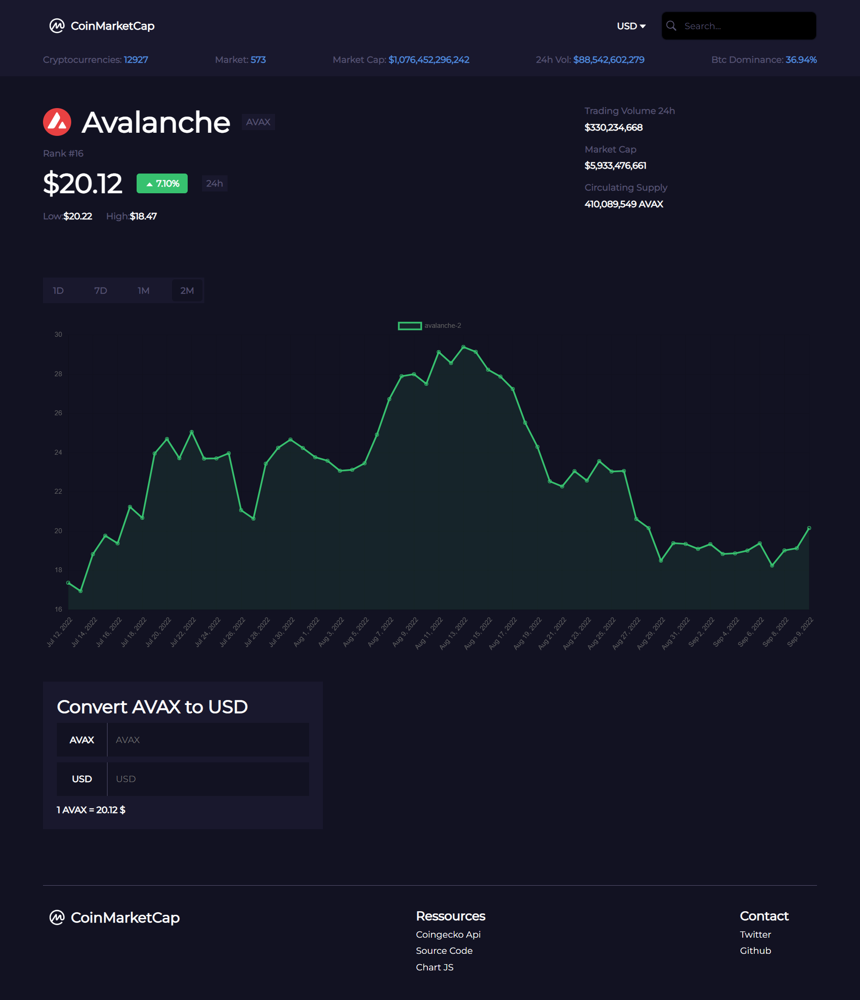
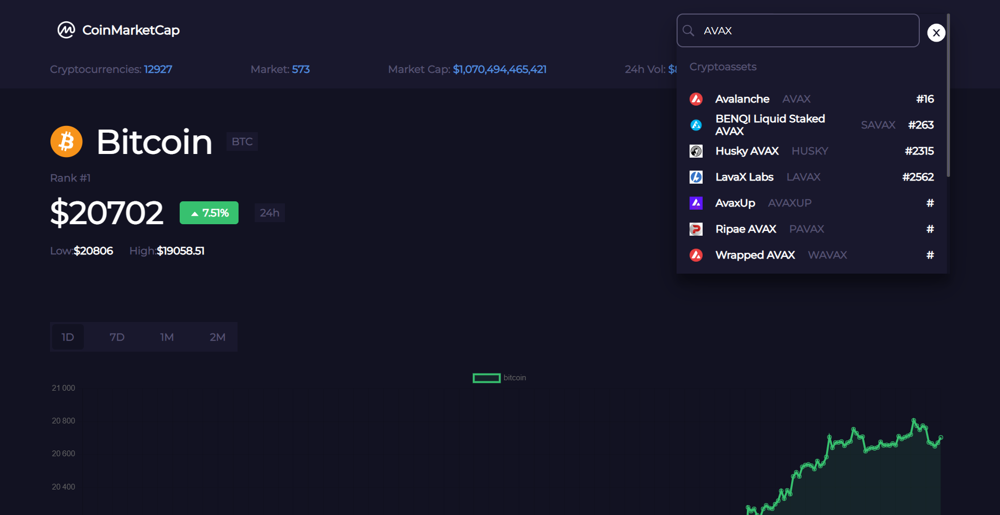

# CoinTracker

[](https://twitter.com/kds_JS)

[](https://twitter.com/kds_JS)

### C'est un clone de CoinMarketCap
#### Le site est responsive

## Tâches
 - [x] Afficher le top 100 cryptomonnaies par marketcap
 - [x] Modifier la devise par défaut (USD,EUR)
 - [x] Convertir les cryptos en devise (USD,EUR)
 - [x] Afficher le graphique en (24h,7D,1M,2M)
 - [x] Afficher les détails de chaque crypto
 - [x] Ajout de la barre de recherche
 - [x] Proposition de réponse lors de la recherche

## [LIVE ICI](https://kds-coin-tracker.vercel.app/)

## Technologies utilisés 
 - React
 - SCSS
 - Chart JS
 - [L'API de Coingecko](https://www.coingecko.com/en/api/documentation)

### Installation

1. Cloner le repo github
   ```sh
   git clone https://github.com/Kds-JS/CoinTracker-app.git
   ```
2. Installer les dépendances
   ```sh
   npm install
   ```
3. Lancer l'application
   ```sh
   npm start
   ```

## Contact

Kds - [@twitter](https://twitter.com/kds_JS) 

Lien du Projet: [https://github.com/Kds-JS/CoinTracker-app.git])
